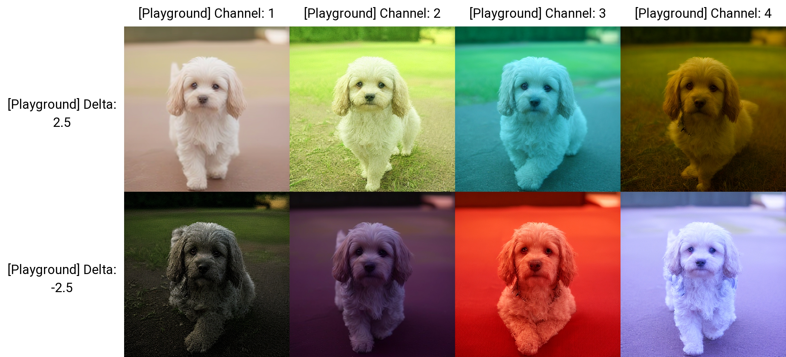
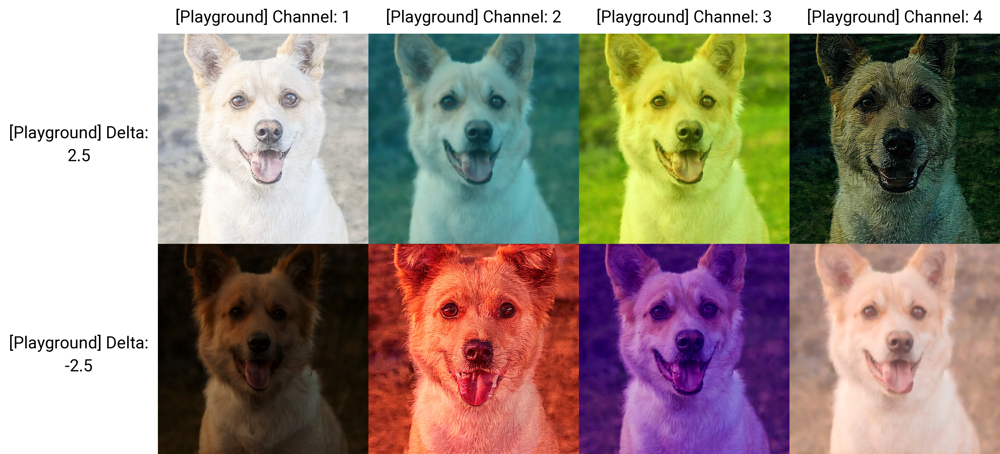

# SD Webui Latent Playground

> [!NOTE]
> It is rather pointless to install this "Extension," as the results are already shown below...

## SD1
- **Channels:** `4`
- **Color Model:** [CMYK](https://en.wikipedia.org/wiki/CMYK_color_model)

<table>
<thead>
    <tr align="center">
        <td><b>Channel</b></td>
        <td><b>-K</b></td>
        <td><b>-M</b></td>
        <td><b>C</b></td>
        <td><b>Y</b></td>
    </tr>
</thead>
<tbody>
    <tr align="center">
        <td><b>Higher</b></td>
        <td>White</td>
        <td>Green</td>
        <td>Cyan</td>
        <td>Yellow</td>
    </tr>
    <tr align="center">
        <td><b>Lower</b></td>
        <td>Black</td>
        <td>Magenta</td>
        <td>Red</td>
        <td>Blue</td>
    </tr>
</tbody>
</table>

 

## SDXL
- **Channels:** `4`
- **Color Model:** [Y'CbCr](https://en.wikipedia.org/wiki/YCbCr)

<table>
<thead>
    <tr align="center">
        <td><b>Channel</b></td>
        <td><b>Y'</b></td>
        <td><b>-Cr</b></td>
        <td><b>-Cb</b></td>
        <td><b>"Pattern"</b></td>
    </tr>
</thead>
<tbody>
    <tr align="center">
        <td><b>Higher</b></td>
        <td>White</td>
        <td>Blue</td>
        <td>Yellow</td>
        <td>N/A</td>
    </tr>
    <tr align="center">
        <td><b>Lower</b></td>
        <td>Black</td>
        <td>Red</td>
        <td>Purple</td>
        <td>N/A</td>
    </tr>
</tbody>
</table>

 

## Flux
- **Channels:** `16`
- **Color Model:** `T.B.D`

